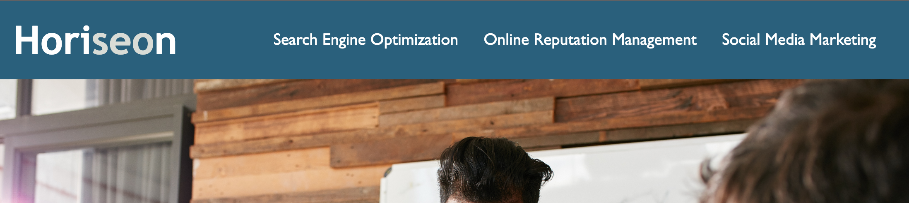
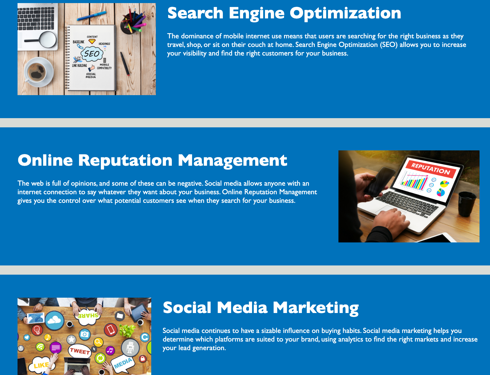

# Accessibility Is Groovy

## Description

The purpose of this project was to improve the existing websites accessibility features by implementing semantic HTML tags, adding alt descriptions to images, and ensuring the HTML code followed a logical structure independent of styling and positioning. This was doen to optimize the site for search engines. The applications CSS was improved by consolidating selectors and combining elements that share the same styling in order to avoid repeating code that might slow the site rendering down.

## Installation

NA

## Usage

The site can be accessed from the live URL :

To navigate the site use the three links in the navigation bar at the top right of the screen.

Click on "Search Engine Optimization", "Online Reputation Management", or "Social Media Marketing" to be taken to the corresponding section of the site. These sections contain detailed information on why these services are needed.

To the right of the main article are some listed benefits of utalizing Horisean services.

## License

MIT